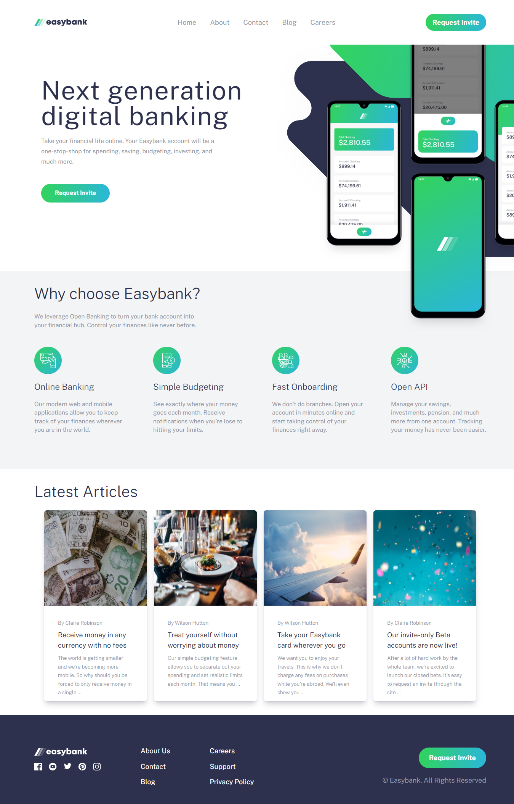

# Frontend Mentor - Easybank landing page solution

This is a solution to the [Easybank landing page challenge on Frontend Mentor](https://www.frontendmentor.io/challenges/easybank-landing-page-WaUhkoDN). Frontend Mentor challenges help you improve your coding skills by building realistic projects.

## Table of contents

- [Frontend Mentor - Easybank landing page solution](#frontend-mentor---easybank-landing-page-solution)
  - [Table of contents](#table-of-contents)
  - [Overview](#overview)
    - [The challenge](#the-challenge)
    - [Screenshot](#screenshot)
    - [Links](#links)
  - [My process](#my-process)
    - [Built with](#built-with)
    - [What I learned](#what-i-learned)
  - [Author](#author)
  - [Acknowledgments](#acknowledgments)

## Overview

### The challenge

Users should be able to:

- View the optimal layout for the site depending on their device's screen size
- See hover states for all interactive elements on the page

### Screenshot



### Links

- Solution URL: [Add solution URL here](https://your-solution-url.com)
- Live Site URL: [Add live site URL here](https://your-live-site-url.com)

## My process

### Built with

- Semantic HTML5 markup
- CSS custom properties
- Flexbox
- CSS Grid
- Mobile-first workflow
- [React](https://reactjs.org/) - JS library
- [Nx Console](https://nx.dev/) - For Setup
- [TailwindCss](https://tailwindcss.com/) - For Styles

### What I learned

Working with nx console and Gsap animation libary for the first time

```js
import ArticleSection from '../Components/ArticleSection/ArticleSection';
import FooterSection from '../Components/FooterSection/FooterSection';
import HeroSection from '../Components/HeroSection/HeroSection';
import InfoSection from '../Components/InfoSection/InfoSection';
import Navbar from '../Components/Navbar/Navbar';
import styles from './app.module.scss';
import Animations from '../animations/index';

export function App() {
  return (
    <div className={styles['App']}>
      <Navbar />
      <HeroSection />
      <InfoSection />
      <ArticleSection />
      <FooterSection />
      <Animations />
    </div>
  );
}

// React makes Code look so clean👌👌
export default App;

```

## Author

- Frontend Mentor - [@Enx_dev](https://www.frontendmentor.io/profile/Enx_dev)
- LinkedIn - [@yourusername](https://www.linkedin.com/in/eniola-adejori-0a3091204/)
